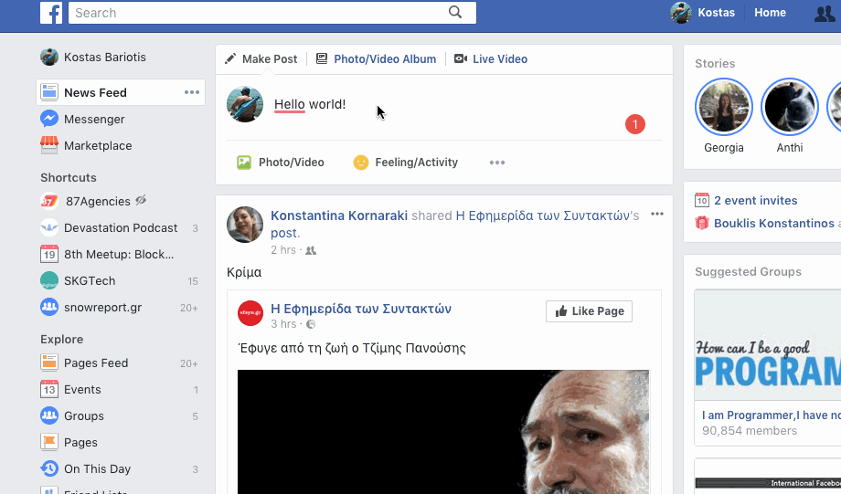

# Custom modal dialog to prevent route transitions

I wanted to make something like FB's custom dialog with react, react-router & redux.

## How
The routing is synced with the store and the transitions are being created by redux actions. This way we can implement a middleware that will watch for specific transitions and dispatch actions such as showing a modal dialog.

## Todo
Create a higher-order component to protect routes from transitioning away from them.

## Contribute
Feel free!
